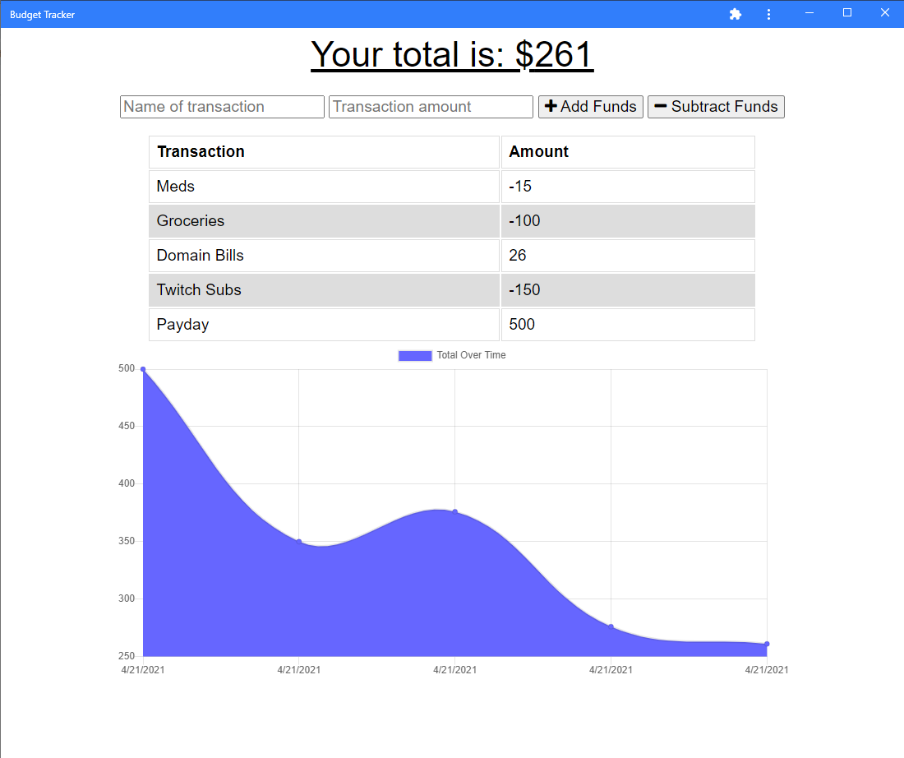

# Budget Tracker

## Table of Contents

- [License](#license)
- [Links](#links)
- [User Story](#user-story)
- [Technology Used](#technology-used)
- [Screenshots](#screenshots)
- [Questions](#questions)

## Description

This Budget Tracker is a homework project with the front end coded provided by Trilogy. The idea is to get more comfortable using Mongo databases and have a working online and offline PWA budget tracking app.

## License

- 

## Links

- [Github Repository](https://github.com/emacartoon/budget-tracker)
- [Heroku App](https://budget-tracker-abroad.herokuapp.com/)

## User Story

As an avid traveller, I want to be able to track my withdrawals and deposits with or without a data/internet connection so that my account balance is accurate when I am traveling.

## Technology Used

JavaScript
Node.js 
Express.js
MongoDB
IndexedDB

## Screenshots

Screenshot - Offline App

## Questions

If you have any questions about this project, or happen to use this project, please feel free to reach out to me:
 
Email: emacartoon@gmail.com
 
GitHub: [@EmaCartoon](https://github.com/EmaCartoon)